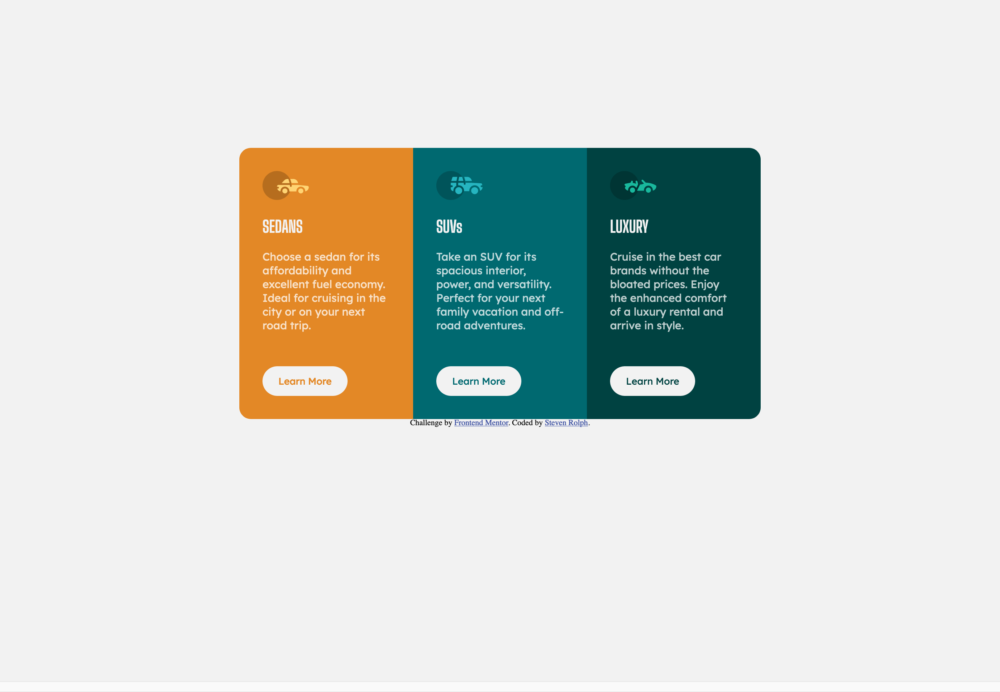

# Frontend Mentor - 3-column preview card component solution

This is a solution to the [3-column preview card component challenge on Frontend Mentor](https://www.frontendmentor.io/challenges/3column-preview-card-component-pH92eAR2-). Frontend Mentor challenges help you improve your coding skills by building realistic projects.

## Table of contents

- [Overview](#overview)
  - [The challenge](#the-challenge)
  - [Screenshot](#screenshot)
  - [Links](#links)
- [My process](#my-process)

  - [Built with](#built-with)
  - [What I learned](#what-i-learned)
  - [Continued development](#continued-development)

- [Author](#author)

**Note: Delete this note and update the table of contents based on what sections you keep.**

## Overview

### The challenge

Users should be able to:

- View the optimal layout depending on their device's screen size
- See hover states for interactive elements

### Screenshot



### Screenshot (mobile)


### Links

- Solution URL: [Add solution URL here](https://your-solution-url.com)
- Live Site URL: [Add live site URL here](https://your-live-site-url.com)

## My process

### Built with

- Semantic HTML5 markup
- CSS custom properties
- Flexbox & CSS Grid
- Desktop-first workflow

### What I learned

I initially thought I'd have to use the alpha channel for rgb or hsl to imitiate transparency on the hover pseudo-class, however a quick search on MDN docs showed there was a better way.

```css
button:hover {
  color: hsl(0, 0%, 95%);
  background-color: transparent;
  border: 2px solid hsl(0, 0%, 95%);
}
```

This was a great opportunity to practice with Grid and Flexbox.

## Author

- GitHub - [@valleyman89](https://github.com/valleyman89)
- Frontend Mentor - [@valleyman89](https://www.frontendmentor.io/profile/valleyman89)
- Twitter - [@steven_rolph](https://www.twitter.com/steven_rolph)
